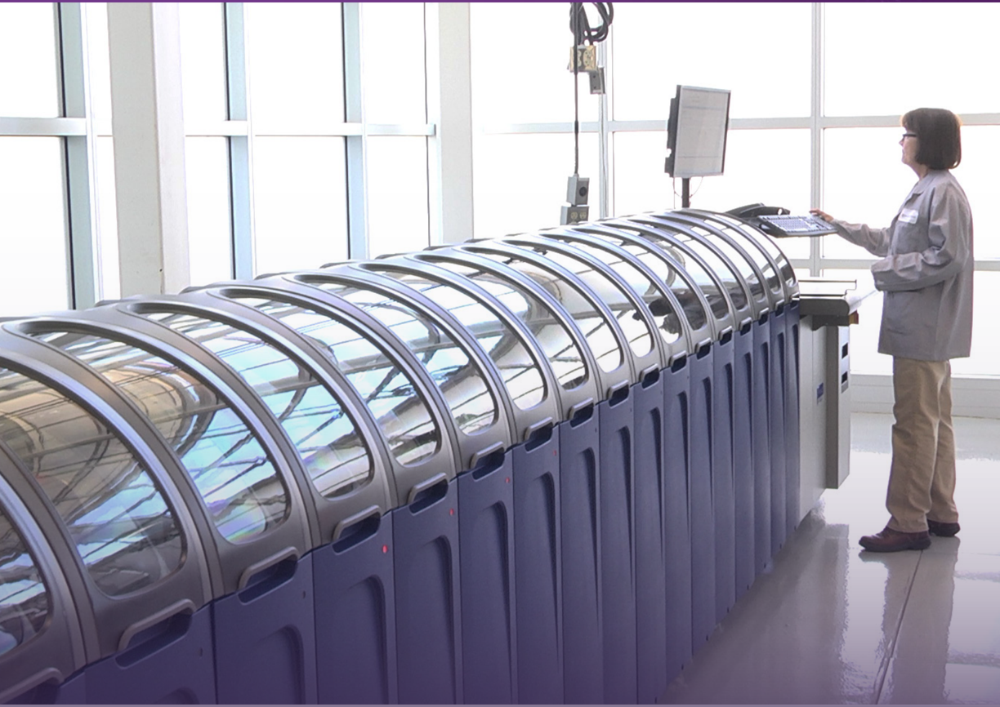
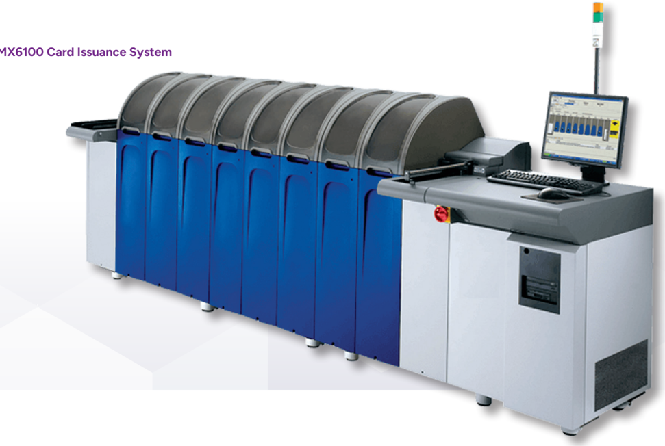
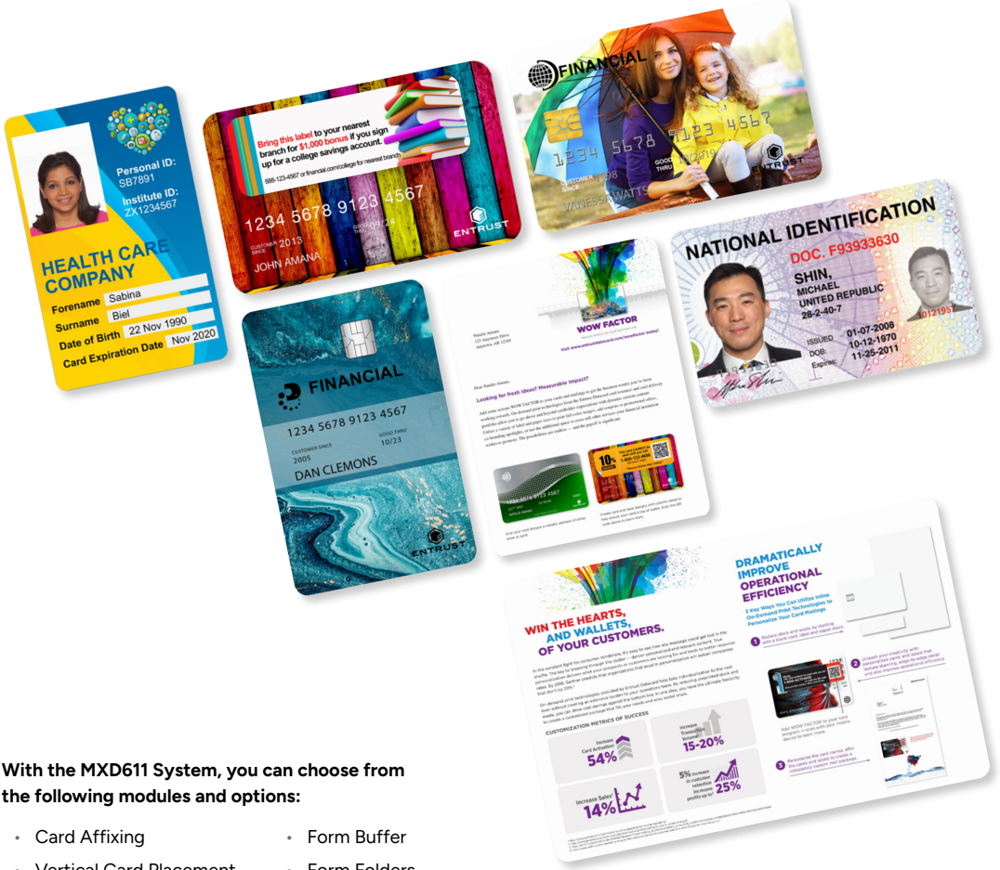
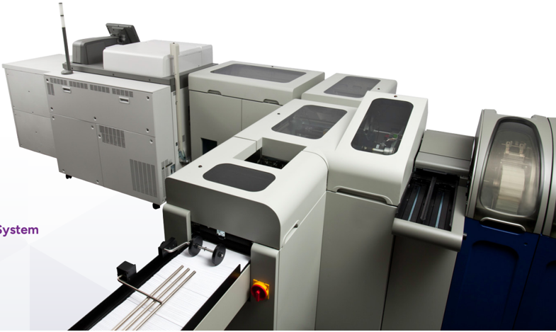
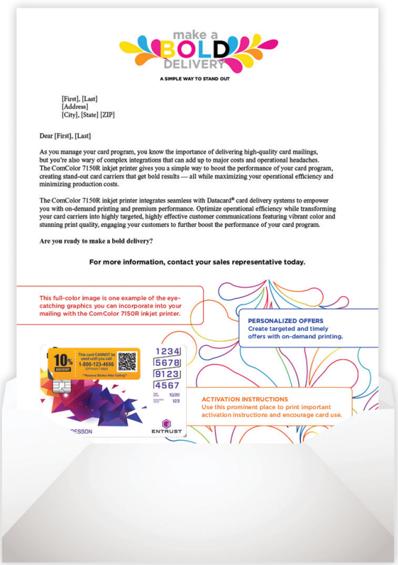
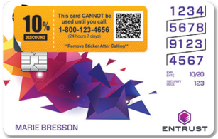
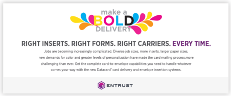
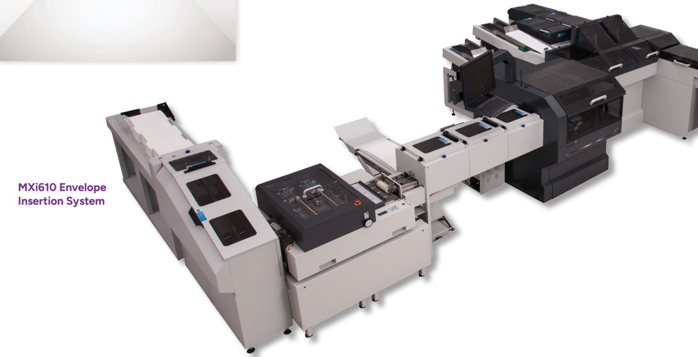
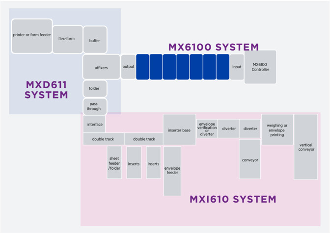
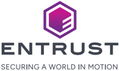

## SOLUTION BROCHURE

## Datacard® MX Series System

World’s Best-Selling High-Volume, Card-To-Envelope Solution

The Datacard ® MX Series solution features the most versatile card
personalization technologies for cardholder customization. This flagship
solution combines security, reliability, and a variety of innovative and
flexible technologies to deliver highly personalized cards, labels, and
carriers all inline - creating a feature-rich card-to-envelope solution.

MX6100 ™ MXD611 ™ MXi610 ™ \## Add Versatile Technologies for Cardholder
Customization \## Datacard ® MX6100 ™ Card Issuance System This flagship
card issuance system (not just of our portfolio but of the industry as a
whole) combines more than a decade of impeccable reliability and
security with a steady flow of new card personalization modules and
inline/standalone card delivery options. It’s the ideal system for any
operation that takes metrics seriously from cards-per-hour and
cost-per-card to image quality and mailing accuracy. Up to 1,800 CPH
rated speed keeps operations moving quickly. \## Intelligent Issuance -
System Controller Gen 2 - Card Input Gen 2 - Metal Card Input - Card
Cleaning Gen 2 - Card Scanner Gen 2 - Vision Verification Gen 3 -
Magnetic Stripe Encoding Gen 2 - Barrel Smart Card Personalization Gen
2 - Durable Graphics Printing Gen 2 - Graphics Printing Gen 3 - Datacard
® Artista ® VHD Retransfer Color Printing Gen 2 - Color Printing Gen 2 -
Drop on Demand Printing Gen 2 - Duplex Drop on Demand Printing - Laser
450F - Laser 450G - Basic Topcoat Gen 2 - Datacard ® CardGard ®
UV-Curing Topcoat - Datacard ® DuraGard ® Laminate - Secure Indent -
Embossing Gen 2 - Topping Gen 2 - Color Label Printing - Label Affixing
Gen 2 - Card Flipper Gen 2 - Single-Card Buffer Gen 2 - Multi-Card
Buffer Gen 2 - Quality Assurance Gen 2 - Card Output Gen 2 - Metal Card
Output - Datacard ® MXD611 ™ Card Delivery System - Datacard ® MXi610 ™
Envelope Insertion System

1 spans more than 150 countries worldwide. Online and phone support is
available 24/7. D0 Card Issuance System \## Flagship High-Volume Card
Issuance Solutions Powerful Integrated Software: Controller Software
provides a single interface for all interactions with the MX6100 System.
This powerful software manages seamless access to the system, enables
creation of card and job setups, and tracks production level audits to
empower card operation efficiency and security. Innovative Inline
Technologies: Provide stunning, high-quality, edge-to-edge printing on
cards and labels or sleek flat-card designs with UV-curable printing
technologies, all inline to help deliver unique and highly personalized
eyecatching designs. True Field Modularity: Provides a full suite of
personalization technologies and your choice of card delivery options.
The common MX Series Software Platform gives you freedom, flexibility,
and investment protection as you continue to build your operation. Start
with the capabilities you need, then expand the system as your program
requirements change. Smart Card Productivity: An innovative smart card
module - powered by Adaptive Issuance ™ Chip Interface Software -
features a barrel dual interface design and choice of couplers to
accommodate any combination of contact, contactless, dual interface, or
combi smart cards. Intelligent Quality Assurance: Advanced intelligence
built into the MX6100 System enables fully automated, inline quality
assurance for all personalization, including embossed characters along
with correct matching of cards, carriers, and inserts. Service And
Support: The MX Series Systems are supported by the industry’s largest
service and support network, which spans more than 150 countries
worldwide. Online and phone support is available 24/7.

· Card Affixing \| • Card Affixing \| • Form Buffer \|
\|—————————\|————————–\| \| • Vertical Card Placement \| • Form Folders
\| \| • Black and White Printer \| • Card Carrier Stock and \| \| •
Color Printer \| Template Verification \| \| • Pre-printed Form Feeder
\| • Card Carrier Sorter \| \| • Flex-form \| • Form Stacker \|
FINANCIAL \## Flexible, Feature-Rich Card-To-Envelope Solutions
883-123-4567 or financial.com/college for nearest branch USTOMER 998
VANESSA WATTS GOOL THRU 1201 ITRU ENTRUST

NATIONAL IDENTIFICATION s horizontally and vertically to meet customer
requests. \## Make A Big Impact With Cardholders With larger card
carriers and bold color printing, you now have more opportunities for
customized 1:1 marketing that can help you build stronger relationships
with your cardholders. Use the extra space for personalized marketing
messages that encourage card activation and usage as well as images that
reflect the cardholder’s lifestyle and interests. Promote coupons,
special offers, advertising, and crossselling opportunities to grow
revenue. \## Datacard ® MXD611 ™ Card Delivery System Streamlined Data
Flow: Both card personalization and card delivery systems use one set of
data and file names resulting in increased data security and reduced IT
interventions. On-Demand Color Printing: High-quality printing helps
reduce pre-printed forms. Crisp, full-color, near-edge printing makes it
easy to add visual impact and promotional content to your mailings.
Flexible Form Sizes: This additional real estate is perfect for printing
expanded terms and conditions and adding cross-promotional content to
your mailers. Regroup Production To Drive Uptime & Efficiency: Card
carrier sorting provides the flexibility to remove inefficiencies from
the inline process and/or reorganize finished card carriers to maximize
production. Support Market Trends: Meet the growing vertical card trend
without limiting job sizes based on card orientation. Dynamically place
cards on carriers horizontally and vertically to meet customer requests.
MXD611 Card Delivery System

\## Comprehensive Envelope Insertion Bring the reliability and security
you need to complete high-quality finished mailings by adding robust
inserting capabilities. Include a variety of additional inserts and
forms to your card mailings to add a personal touch to each package and
help build lasting relationships with your customers. \## Datacard ®
MXi610 ™ Envelope Insertion System \## Maximize Uptime and Efficiency To
drive continuous inline advantages, the MXi610 System offers a robust
envelope insertion system. Built-in automation throughout the process
helps ensure fast job changes with minimal downtime and operator
intervention. \## Divert and Sort Control your production priorities and
drive your system based on business needs. Enhanced functionality allows
you to automatically divert mail packages, rank important deliveries,
and organize output for efficient distribution. \## Selective Insertion
Intelligence built in to help drive larger job runs and production
throughput. \## Precise Packages Inline verification automatically
weighs each package or checks the thickness of each piece to verify that
the envelope has the correct cards, carriers, and inserts for each
cardholder - every time. \## Customized Packages Print on-demand,
personalized messaging, or static logo graphics on the envelope. \##
Support Rewards Programs Card carrier feeding supports the insertion of
additional card carriers in a single package. This allows for more gift
or reward cards to be bundled in one package. NO ONY SOLAYM MESY TEZ\|
(8499\| \[82 16 L99₺ \## Complete Card-To-Envelope Solutions
0001101900010S07819998

With the MXi610 System, you can choose from the following modules: -
Insert Feeder - Sheet Feeder/Folder - Accumulator/Folder - Inserter
Base - Envelope Printing/ Franking - Verification - Standard Divert \*OL
(step 2 sunou p2) - Vertical Conveyor Options - Card Carrier Feeder \##
Technical Specifications \| MX6100, MXD611, and MXi610 System
Specifications \| MX6100, MXD611, and MXi610 System Specifications \|
\|—————————————————-\|——————————————————————————————————————————————————————————————————————————————-\|
\| Rated Speed \| Up to 1,800 CPH \| \| Operating System \| Microsoft ®
Windows ® 10 IoT Enterprise 2021 LTSC \| \| Template Management \|
Microsoft ® Word 2019 \| \| Maximum Configuration \| MX6100: Up to 28
personalization modules MXD611: Up to 1 system per personalization
system MXi610: Up to 1 system per MXD611 System \| \| Cards Per Form \|
Up to 4 cards on middle and/or lower panels. Up to 5 cards are allowed
with the Vertical Card Placement Option. \| \| Printer Ready Data \| PCL
(black and white), PDF \| \| Electrical Requirements \| MX6100: 230V,
50/60Hz, 15 Amps MXD611: 230V, 50/60Hz, 30 Amps MXi610: 230V, 50/60Hz,
30 Amps \| \| Operating Requirements \| Room temperature: 65° to 80° F
(18° to 27° C); Humidity: 35% to 85% (non-condensing) Recommend service
area around system be at least 36 in. (76.2 cm) to help provide adequate
airflow. See module data sheets for specific information. \| \| Storage
Requirements \| Room temperature: 50° to 130° F (10° to 54° C);
Humidity: 0% to 85% (non-condensing) \| \| Agency Approvals \| FCC, UL,
cUL, CE, and RoHS Compliant \| \| Card Types Supported \| ISO/IEC 7810
ID-1 Size; 30 mil (+/- 10%) \| \| Card Materials Supported \| Most card
materials can be processed, including PVC, composite, polycarbonate,
ABS, PET, and PETG. Limitations may exist for each personalization or
verification technology. \| \| Paper Types Supported \| 20-24 lb bond
paper (90.3 gsm) See Card Delivery Paper/Envelope Guidelines. \| Note:
MX6100 System modules cannot be used in the Datacard ® MX2100 ™ Card
Issuance System and MX2100 System modules cannot be used in the MX6100
System. \## Flexible End-To-End Issuance

\## A B O U T ENTRUS T Entrust fights fraud and cyber threats with
identity-centric security that protects people, devices, and data. Our
comprehensive solutions help organizations secure every step of the
identity lifecycle, from verifying identity at onboarding to securing
connections and fighting fraud in everyday transactions. Ongoing
monitoring supports compliance and safeguards keys, secrets, and
certificates. With a foundation of identity-centric security, our
customers can transact and grow with confidence. Entrust has a global
partner network and supports customers in over 150 countries. Learn more
about the MX Series at entrust.com ©2025 Entrust Corporation. All rights
reserved. Entrust, Datacard, and the hexagon logo are trademarks,
registered trademarks, and/or service marks of Entrust Corporation in
the U.S. and/or other countries. All other brand or product names are
the property of their respective owners.
CI26Q2-mx-6100-series-card-issuance-system-br

